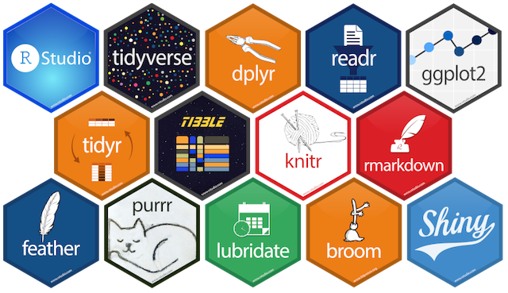

### Programming Language

### Authors and Assigning Roles
- **Jiarong Li**, *MS Business Analytics at American University*
  + Find out the top ten brands and colors each year, create a word cloud and complete the price distribution.
  
- **Shan Lin**, *MS Data Science at American University*
  + Bivariate analyze the relationship between the two values to facilitate the lady's purchase decision.
  
- **Xubo Tang**, *MS Business Analytics at American University*
  + Descriptive analysis by date, univariate analysis with data visualization.
  
- [**Yunting Chiu**](http://linkedin.com/in/yuntingchiu), *MS Data Science at American University*
  + Tidy and clean data to a readable format solely. Build statistical inferences for the user interface, such as a t-procedure and a simple linear regression model to compare the prices of shoes price with different years.

### Use Cases
With the improvement of women’s economic ability and the variability of fashion demands, women’ shoes have become an important part of the footwear market as their demands for shoes increased. Some problems with meaningful business insights are brought to the attention of related parties, such as analysts, vendors and their customers: What is the average price of each distinct brand? Which brands have the highest prices? Which one has the widest distribution of prices? Is there a typical price distribution (e.g., normal) across brands or within specific brands? Is there an obvious difference in price between online and in store? The Shiny App of this project aimed to answer these questions and is used to determine brand markups, pricing strategies, and trends for luxury shoes.

### Required Packages
1. **`shiny`**: Package shiny version 1.5.0. The Shiny package helps establish relationships with web applications in R. Help us build programs with minimal effort to develop inputs and outputs.

2. **`tidyverse`**: Package tidyverse version 1.3.0. The tidyverse package is a package that helps coordinate work with each other. Installing this package can easily install and load the core package from tidyverse.

3. **`broom`**: Package broom version 0.7.0. The broom package accepts the messy output of built-in functions in R, such as lm, NLS, or t-test, and converts them into neat data frames.

4. **`lubridate`**: Package lubridate version 1.7.9. The lubridate package focuses on the processing of Date-time data.

5. **`shinythemes`**: Package shinythemes version 1.1.2. The Shinythemes package gives the standard style themes of Shiny apps

6. **`mosaic`**: Package Mosaic version 1.8.2. Data sets and utility programs of MOSAIC package for teaching mathematics, statistics, calculations and modeling

7. **`wordcloud2`**: Realize data visualization. Compared with a word cloud, wordcloud2 can more effectively use the interval between words to insert data and draw customized word clouds based on pictures or text.

8. **`Tidytext`**：Package tidytext version 0.2.6. The Tidytext package implements a clean data separation, making the task of mining data more efficient.

### Data Sources and Structures
The [dataset1](https://data.world/datafiniti/womens-shoe-prices/workspace/file?filename=Datafiniti_Womens_Shoes_Jun19.csv) [dataset2](https://data.world/datafiniti/womens-shoe-prices/workspace/file?filename=7003_1.csv) and [dataset3](https://data.world/datafiniti/womens-shoe-prices/workspace/file?filename=Datafiniti_Womens_Shoes.csv) are from the [Data.World](https://data.world/) and created by Datafiniti. We combined these 3 datasets into one dataset.

The newest Datasets were updated in 2019, which is a list of 10,000 women's shoes in Walmart stores between March 2019 and May 2019. There are 29 variables which contain price, brand, manufacture, ID, price discount, price size, shoes size, date created, image URL and so on. 

Besides, the second dataset was updated in 2018, which is a list of 10,000 women's shoes in Walmart stores between January 2018 to October 2018. There are 34 variables which contain id, dataadded, dateupdated, asins, brand, categories, primarycategories, colors, dimension, imageurls, keys, manufacturer, manufacturernumber, name, prices_amountmax, prices_availability, prices_color, prices_condition, prices_currency, prices_dataadded sizes, sourceurls, upc, weight, and so on.

Finally, the third dataset was updated in 2017, which is a list of 19,045 rows in table. There are 47 variables which contain id, asins, brand, categories, colors, count, dataadded, dataupdated, descriptions, dimension, ean, features, flavors, imageurls, isbn, keys, manufacturer, manufacturernumber, merchants, name, prices_amountmax, prices_availability, prices_source, prices_sourceurls, prices_warranty, quantities, reviews, sizes, skus, sourceurls, upc, websiteids, weight and so on.

After going through the dataset, there are some variables could be used for analysis: `dataadded`, `brand`, `categories`, `colors`, `manufacturer`, `price`, `price.color`, `price.offer`(channel and discount), `price.size`, `sizes` and so on. So we decided to remain these variables and merge three datasets to one data frame.

### Data Types and Variables
After we tided and cleaned data, the data frame comprises 12 variables and 39,045 observations from 2014 to 2019 with the following descriptions:

1. `date`: `<Date>` date added between 2014 to 2019.
2. `time`: `<S4: Period>` date added between by hour-minutes-second format
3. `brand`: shoe brands
4. `categories`: `<chr>` type of categories in Walmart stores
5. `colors`: `<chr>` actual color of the shoes
6. `manufacturer`: `<chr>` manufacturer brands
7. `prices`: `<dbl>` original shoe prices in USD
8. `prices.color`: `<chr>` specific color of the shoes
9. `prices.offer`: `<chr>` online or in store with discount
10. `sizesUS`: `<dbl>` United States shoe sizes
11. `discount`: `<dbl>` the discounted percentage * 100. e.g. 70 is 70 % off
12. `prices.discounted`: `<dbl>` after discounted shoe prices in USD

### Exploratory Data Analysis Inputs, Controls, and Outputs
For this case, the APP totally has 6 panels: vignette, descriptive analysis by date, scatter plots between two variables, month table, statistical models, and data table. The second to fourth panels are for EDA, and the fifth panel is for statistical analysis. In this part, we will focus on the 2-4 panels' inputs, controls, and outputs.

1. **Vignette**: Overall information about the R Shiny APP.

2. **Descriptive Analysis by Date**: In this panel, we want to give the vendors and customers an overall understanding on what happened within a certain date range. So in this panel, the input is very simple: date range. The main outputs are brand sales ranking, color cloud and price distribution. It can show which brand is the most popular within a certain time? What is the fashion color within a certain time? What is the price distribution within a certain time? This segment helps users to receive solutions.

3. **Scatterplots**: In this panel, we want to know the relationship between *x* and *y* variables. It is significant to know the correlation between variables for further statistical analysis. The inputs are *varX* and *varY*. The output is the scatter plot between these two variables. According to the output, we could know the correlation between variables.

4. **Month Table**: we would like to take a look on the dataset itself. The table is used to find the information by month as needed. Besides, it is used to sort a column in ascending or descending order to quick understand the data structure.

### Statistical Analysis Inputs, Controls, and Outputs

Like the last part introduced, we totally have 6 panels, and the fifth panel is for statistical analysis. In this part, we will focus on the statistical inferences's inputs, controls, and outputs. 

5. **Statistical Models**: we will only focus on data from 2015 to 2019 because there are only 84 observations in 2014. Based on the dataset, we would like to see is there any difference between two variables by using t-test and to use simple linear regression to see the linear associations in the panel. First, exploratory data analysis. In this method, users can see the basic information for each variable. For instance, mean, max, standard deviation and so on. Second, data transformation. If *x* and *y* have not met assumptions, we can consider using logarithm by changing a *x* variable and a *y* variable. Third, two-sided t-test. We used two sample t-test to analyze if there is a significant difference between *x* and *y* variable with 95 % confidence intervals. Finally, simple linear regression. By using this method, we can find the linear association between *x* and *y* variables. If there is a relationship between x and y, we can see the summary table to explain the OLS relationship between two variables.

6. **Data**: This table shows full data with 12 variables and 39,045 observations.

### References 
- Awesome Walmart Wallpapers. (n.d.). Retrieved December 07, 2020, from https://wallpaperaccess.com/walmart
- EU to US shoe size: Conversion charts for women, men &amp; kids. (n.d.). Retrieved November 01, 2020, from https://www.blitzresults.com/en/shoe-size-euro/
- Learn generalized linear models (GLM) using R. (n.d.). Retrieved December 07, 2020, from https://www.kdnuggets.com/2017/10/learn-generalized-linear-models-glm-r.html/2
- Parametric statistics. (2020, October 19). Retrieved December 03, 2020, from https://en.wikipedia.org/wiki/Parametric_statistics
- Ten random useful things in R that you might not know about. Retrieved December 07, 2020, from https://www.elasticfeed.com/ab4da588234cfa0cabc5373f0b69ae5e/
- Wasserstein, R., & Lazar, N. (2016). The ASA statement on p-values: context, process, and purpose. *The American Statistician, 70*(2), 129–133. https://doi.org/10.1080/00031305.2016.1154108
- Women's shoe prices - dataset by Datafiniti. (2019, June 25). Retrieved October 26, 2020, from https://data.world/datafiniti/womens-shoe-prices/workspace/file?filename=Datafiniti_Womens_Shoes_Jun19.csv
